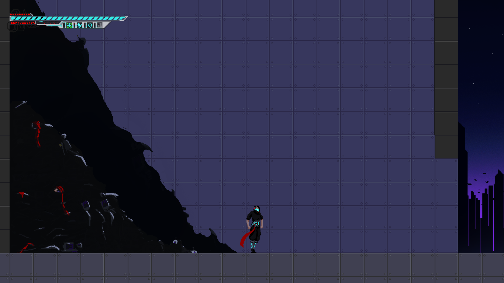
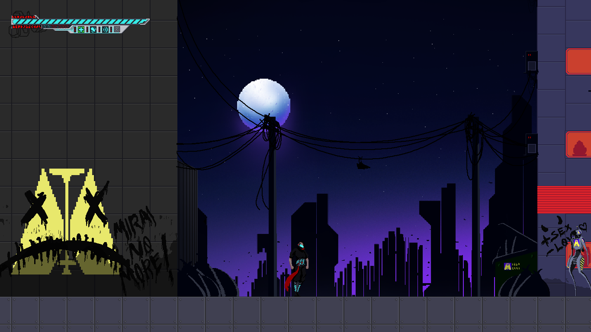
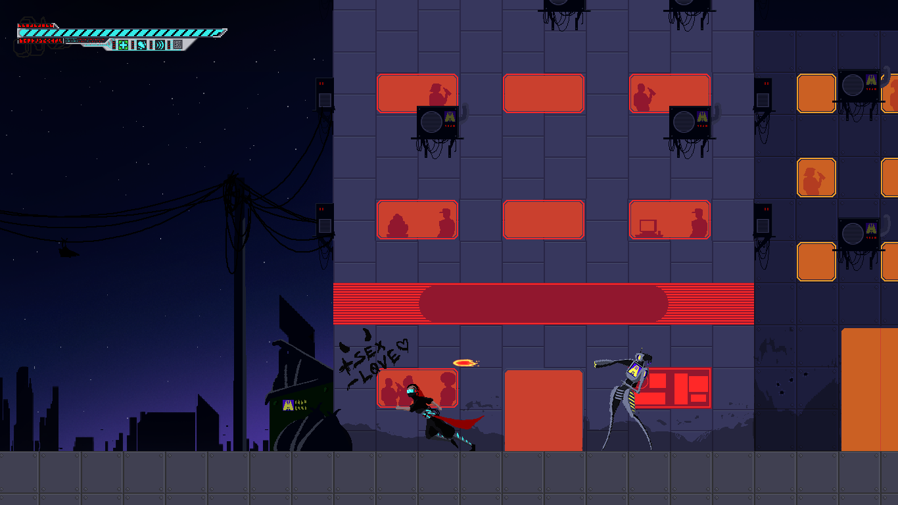
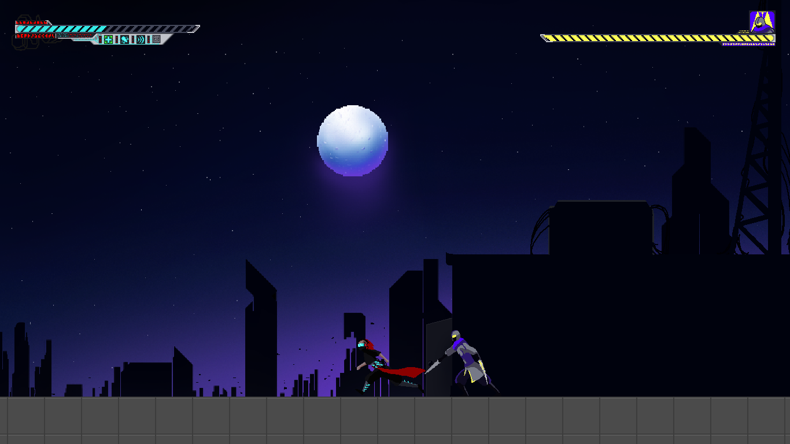
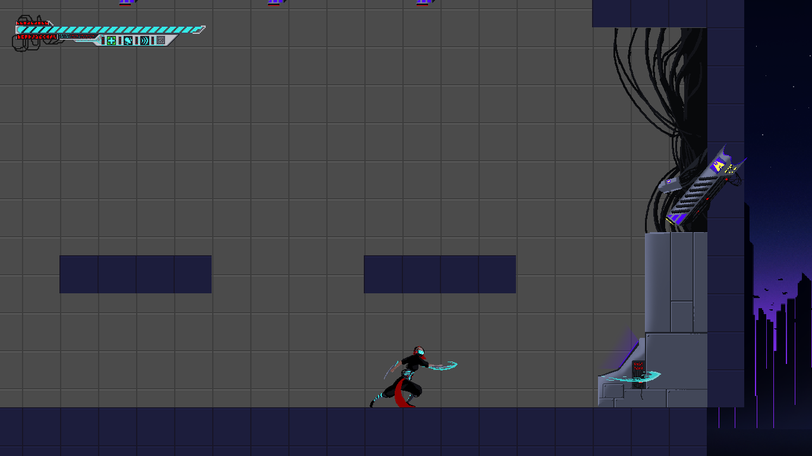

## 1- Breve descrição do jogo, gênero e história:
	
  Shadow Assimilator é um jogo de plataforma no estilo Metroidvania com combate, onde o objetivo é derrotar os inimigos e absorver o poder deles. 
	O jogo se passa em 2077, onde uma organização de mercenários resolveu treinar e fazer experimentos em crianças para criar o assassino perfeito.
	Essas crianças acabam desenvolvendo poderes especiais e se tornam exímios em combate.
	A mais poderosa dessas crianças, que possui o poder de absorver outros poderes, passa por uma experiência de quase morte durante seu teste final e acaba perdendo seus poderes.
	Ela acorda sem suas memórias e, por consequência, sem a lavagem cerebral da organização. A partir daí cabe a ela decidir seu caminho entre matar ou perdoar seus inimigos.

## 2- Objetivo:
	
  É possível ganhar o jogo passando pelas fases e matando o boss final. Caso o jogador morra, aparecerá uma tela de Game Over.
	Além disso, existe uma sala inacabada que pode ser acessada entrando pela janela quebrada na sala do boss.
	
### Controles:

“A” e “D” – Movimentação lateral; 
“W” – Pulo (ao apertar duas vezes, é executado o pulo duplo) (ao apertar enquanto está na parede, é realizado um pulo duplo); 
“J” – Atira (só depois de matar um robô) (possui cooldown); 
“K” – Ataque (ao apertar duas vezes, é executado um ataque duplo); 
“Q” e “E” – Dash pra esquerda e para a direita (Não foi implementado, pois não havia sprite) (possui cooldown); 

### Hacks:

“0”- A protagonista morre; 
“9” – Passa para a próxima tela; 
“8” – Mata todos os inimigos na tela atual; 
“O” – Desativa o ataque com Neon; 
“P” - Ativa o ataque com Neon; 
“BackSpace” – Vai para a tela de vitória; 
"Space” – Spawn de teste;

## 3- Imagens

